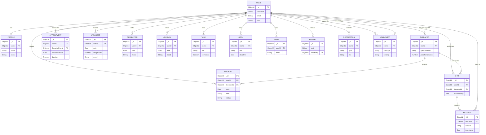

# Database Schema Diagram

This document contains an ER diagram for the main backend models in `be/models` and a short summary of relationships. Add screenshots or export the Mermaid diagram to PNG/SVG if you need an image.

Legend:
- `PK` = Primary key (MongoDB `_id` ObjectId)
- `FK` = Reference to another model (`ObjectId`)
- Cardinality notes: `||` means one, `o{` means many

How to use:
- Open this file in a Markdown viewer that supports Mermaid (VS Code with Mermaid Preview extension or GitHub when rendered) to view the diagram.
- To export to PNG/SVG locally, install `mmdc` (Mermaid CLI) or use an online Mermaid renderer.

Next steps I can do for you:
- Generate a PNG/SVG export of this diagram and add it to `docs/`.
- Produce separate per-model diagrams or a higher-detail ER with all fields included.
- Create a Graphviz DOT version if you prefer that format.

If you want a PNG now, tell me and I'll try to generate it (or give commands to run locally).
